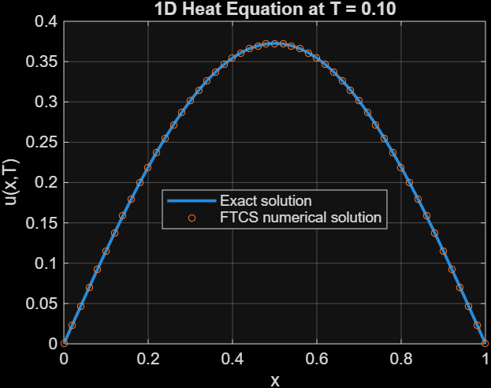
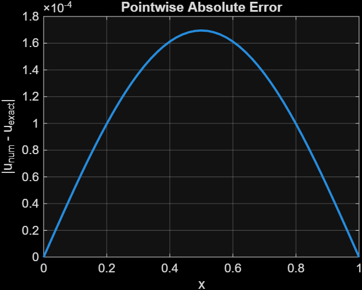
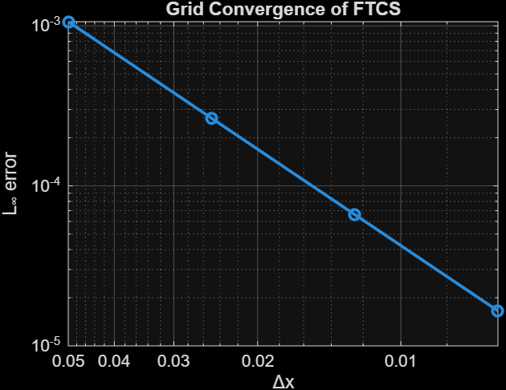
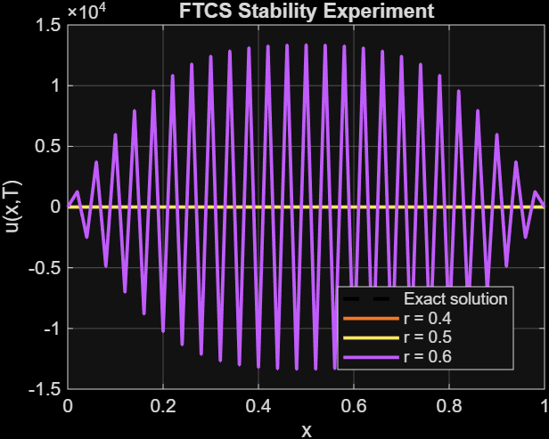
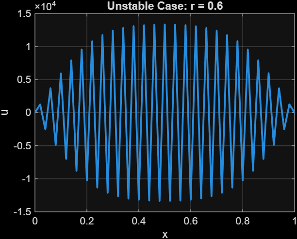

# 1D Heat Equation Using the FTCS Finite Difference Method

This project studies the numerical solution of the one-dimensional heat equation using the Forward-Time Central-Space (FTCS) finite difference method in MATLAB.

The main goals of the project are to:

- implement an explicit finite difference solver,
- compare the numerical solution with an exact solution,
- study grid convergence,
- examine the stability condition of the FTCS method.

---

## Mathematical Model

The one-dimensional heat equation is

\[
u_t = \alpha u_{xx},
\qquad 0 < x < 1,
\]

with homogeneous Dirichlet boundary conditions

\[
u(0,t)=0,
\qquad
u(1,t)=0,
\]

and the initial condition

\[
u(x,0)=\sin(\pi x).
\]

For this problem, the exact solution is

\[
u(x,t)
=
e^{-\alpha \pi^2 t}\sin(\pi x).
\]

---

## Numerical Method

Using a forward difference in time and a centered difference in space,

\[
\frac{u_i^{n+1}-u_i^n}{\Delta t}
=
\alpha
\frac{
u_{i+1}^n
-
2u_i^n
+
u_{i-1}^n
}{
(\Delta x)^2
}.
\]

This gives the FTCS update formula

\[
u_i^{n+1}
=
u_i^n
+
r
\left(
u_{i+1}^n
-
2u_i^n
+
u_{i-1}^n
\right),
\]

where

\[
r=
\frac{\alpha \Delta t}{(\Delta x)^2}.
\]

For the explicit FTCS method, the stability condition is

\[
r \leq \frac{1}{2}.
\]

---

## Main Results

### Numerical and Exact Solutions

The numerical FTCS solution agrees closely with the exact solution for a stable choice of the time step.



---

### Pointwise Error

The pointwise absolute error was computed as

\[
|u_{\text{num}}-u_{\text{exact}}|.
\]



---

## Grid Convergence Study

A grid refinement study was performed using

| \(N_x\) | \(\Delta x\) | \(L^\infty\) Error | Observed Order |
|---:|---:|---:|---:|
| 21 | 0.0500 | \(1.0625\times10^{-3}\) | — |
| 41 | 0.0250 | \(2.6495\times10^{-4}\) | 2.0037 |
| 81 | 0.0125 | \(6.6195\times10^{-5}\) | 2.0009 |
| 161 | 0.00625 | \(1.6546\times10^{-5}\) | 2.0002 |

The observed convergence rate approaches

\[
p \approx 2.
\]

This is consistent with the expected second-order spatial accuracy of the centered finite difference approximation.



---

## Stability Study

The FTCS method was tested for three values of the stability parameter.

| \(r\) | Maximum \(|u|\) | Behavior |
|---:|---:|---|
| 0.40 | 0.820794 | Stable |
| 0.50 | 0.820762 | Stability boundary |
| 0.60 | \(1.33695\times10^4\) | Unstable |

For

\[
r=0.4
\]

and

\[
r=0.5,
\]

the numerical solution remains bounded and close to the exact solution.

For

\[
r=0.6,
\]

the numerical solution develops large oscillations and becomes unstable.

This numerical experiment demonstrates the FTCS stability restriction

\[
r\leq\frac12.
\]



The unstable case is shown separately below.



---

## Repository Structure

```text
1D-Heat-Equation-FTCS/
│
├── main_heat1d.m
├── heat_ftcs.m
├── exact_heat.m
├── convergence_study.m
├── stability_experiment.m
├── README.md
│
├── Results/
│   ├── numerical_vs_exact.png
│   ├── pointwise_error.png
│   ├── convergence.png
│   ├── stability_comparison.png
│   ├── stable_r04.png
│   ├── boundary_r05.png
│   └── unstable_r06.png
│
└── Report/
    └── Heat_Equation_FTCS_Report.pdf
